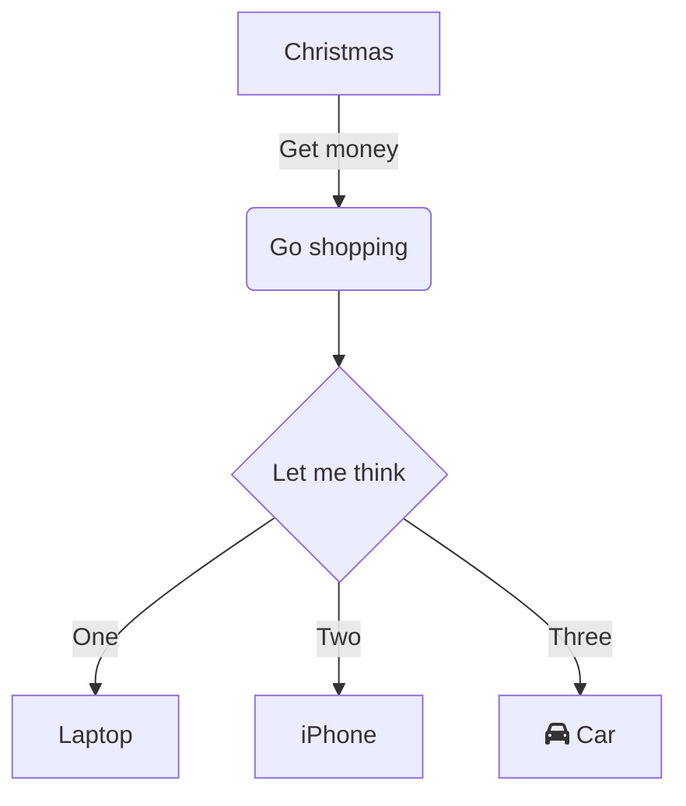
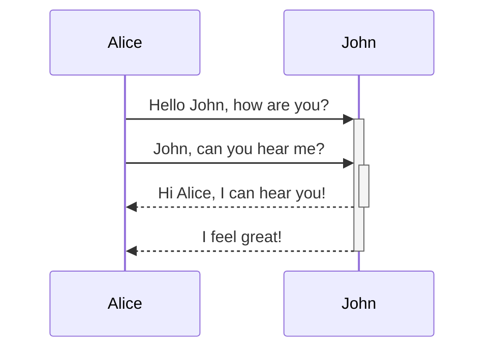
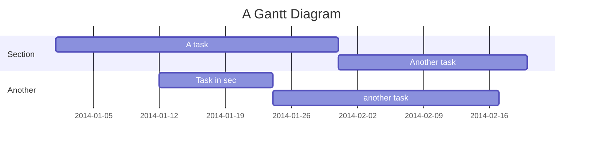

# mermaidjs-lt
A demo of embedded mermaid JS template in markdown.
## Flow Chart

```mermaid
graph TD
	A[Christmas] -->|Get money| B(Go shopping)
	B --> C{Let me think}
	C -->|One| D[Laptop]
	C -->|Two| E[iPhone]
	C -->|Three| F[fa:fa-car Car]
```

## Sequence Diagram

```mermaid
sequenceDiagram
	Alice->>+John: Hello John, how are you?
	Alice->>+John: John, can you hear me?
	John-->>-Alice: Hi Alice, I can hear you!
	John-->>-Alice: I feel great!
```

## Gant Chart

```mermaid
gantt
	title A Gantt Diagram
	dateFormat  YYYY-MM-DD
	section Section
	A task           :a1, 2014-01-01, 30d
	Another task     :after a1  , 20d
	section Another
	Task in sec      :2014-01-12  , 12d
	another task      : 24d
```
